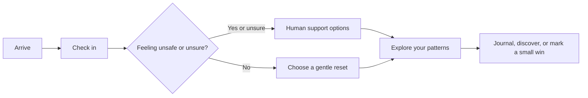

# MANAS — Student Wellbeing Companion
# MANAS — A calmer place to start

**A calmer place to start.** MANAS is a privacy-first wellbeing companion: a student can check in, try one small self-guided reset, write privately, explore gentle content, and find human support. It is not a therapist, diagnosis service, or emergency service.
> **A small pause. A little clarity. One next step.**

## Run locally
MANAS is a gentle, student-focused wellbeing companion built around a simple idea: support should feel approachable before it needs to feel urgent. Check in with yourself, choose a small reset, notice your own patterns, and find a human to talk to when that is what you need.

Requirements: Node.js 20 or newer and npm.
It is designed to feel calm, private by default, and free of streaks, scores, or pressure to “fix” everything at once.

## What makes MANAS different

- **A check-in with a safety pause.** A nine-question reflection helps you name what is going on. If you answer that you feel unsafe or are unsure, MANAS brings support options forward.
- **A reset you can make your own.** Try a timed pause, breathing, grounding, a quiet sound, or one small activity. You can pause or leave whenever you like.
- **Patterns without grades.** Your reflections are shown as things you shared, not a diagnosis or a score.
- **A journal that stays on this device.** Write freely or use a prompt. Export or clear your guest data in Settings.
- **Small wins, no streaks.** Add a kind action to a little growing garden; missed days never count against you.
- **Support stays human.** Find ways to reach someone you trust and India support numbers, including emergency services and Tele-MANAS.
- **A quieter visual space.** Nature-inspired motion, a click-to-load YouTube moment, responsive layouts, and a reduced-motion setting help the interface stay gentle.

## The MANAS flow



## Get started

### Requirements

- Node.js 20 or newer
- npm

### Run the app

```sh
```bash
npm install
npm run dev
```

The app opens in guest mode; no account is required. It saves preferences, journal entries, check-ins, and garden actions to browser localStorage on the current device. This is a demo persistence layer, not encrypted storage: avoid sensitive writing on a shared device. Use Settings to export or clear local data.
Open the local URL printed by Vite. The app starts in guest mode; no account or backend is required.

### Build and check

```bash
npm run build
npm run test:e2e
```

The build runs TypeScript checking before creating the production bundle. The Playwright end-to-end suite covers the main check-in, safety, reset, journal, discovery, settings, and responsive navigation flows. Playwright may need its supported browser installed in a new environment.

## Explore the app

| Area | What you can do |
| --- | --- |
| **Home** | Start a check-in or choose a mood to guide your next step. |
| **Check-in** | Reflect on mood, energy, sleep, connection, needs, intensity, and safety. |
| **Reset** | Pause with a timer, grounding prompts, and gentle activities. |
| **Your patterns** | Review saved check-ins and self-reported energy. |
| **Journal** | Create, edit, export, and delete private entries. |
| **Discover** | Browse optional audio links, a video, and simple attention exercises. |
| **Small wins** | Record kind actions in a growing garden without streaks. |
| **Talk to someone** | Find practical ways to connect with a trusted person or support service. |
| **Settings & privacy** | Set an optional name, reduce motion, export data, or clear local data. |

## Built with

- React and TypeScript
- Vite
- Framer Motion
- Lucide icons
- Zod validation
- Playwright for browser end-to-end checks
- A Spring Boot / PostgreSQL backend outline in `backend/`

## Project map

```text
src/
  App.tsx          App screens and interaction flows
  content.ts       Check-in questions, links, and media configuration
  logic.ts         Local recommendation logic
  services.ts      Validation and guest-mode browser storage
  styles.css       Responsive visual system and motion
e2e/
  app.spec.ts      Browser end-to-end flows
backend/           Spring Boot API and database starting point
docs/              Methodology and evidence limitations
```

## Privacy and safety

To create a production frontend build, run `npm run build`. The Pexels video endpoints are configured as requested; if a browser cannot load them, the interface shows a designed fallback. Browser autoplay policies can affect playback. The music links are search links, not licensed or embedded audio.
MANAS is a **wellbeing demonstration**, not therapy, diagnosis, or emergency care. It does not contact anyone for you. If you may be in immediate danger in India, call **112**, call **Tele-MANAS at 14416**, or move near a trusted person.

## What's included
In the current frontend, guest data is stored in this browser’s `localStorage`. That storage is **not encrypted** and is not a secure account system. Avoid entering sensitive information on a shared device. Export or clear locally saved data from Settings.

- Responsive React/TypeScript interface with Home, nine-question check-in, ten-minute Reset, private journal, Discover, Small Wins garden, Insights, Support, Settings, and an interrupting safety screen.
- Typed personalization and validation modules in `src/logic.ts` and `src/services.ts`.
- India emergency and Tele-MANAS details in `src/content.ts`; the safety screen prioritizes direct human support over normal recommendations.
- Backend contract notes and relational PostgreSQL schema in `backend/`.
- Evidence-informed feature limitations in `docs/methodology.md`.
The backend directory is a starting point for a separate Spring Boot/PostgreSQL service. It is **not currently connected to the frontend**, and cloud accounts or authenticated server-side persistence are not available in this version.

## Architecture status
External video, audio, and support links depend on their providers and network access. The landing-page YouTube video loads only after you choose to open it; a direct YouTube link is available if embedding is unavailable.

The frontend is runnable and interactive as a guest-mode application. `backend/` contains the Spring Boot implementation outline and database migration as a starting point; the Java API, account system, encryption-at-rest key management, secure cookies, and authenticated cloud persistence are not wired into this guest frontend. Do not treat localStorage as encrypted or as a production privacy guarantee. External links and the sample resource verification date must be reviewed for a deployed service.
## Project credit

## Safety & privacy
**Designed & Developed by Muskan Shaikh**

Check-in safety answers interrupt the normal flow. The app does not diagnose, make high-stakes decisions, or contact anyone. India resources are configured centrally. For immediate danger, call 112 or Tele-MANAS 14416, or move near someone safe. Do not rely on this demonstration app for emergency response.
---

See `docs/methodology.md` for evidence limitations and `backend/README.md` for the intended API architecture.
Made for the moments when starting small is enough.
