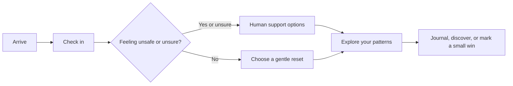

# MANAS — A calmer place to start

> **A small pause. A little clarity. One next step.**

MANAS is a gentle, student-focused wellbeing companion built around a simple idea: support should feel approachable before it needs to feel urgent. Check in with yourself, choose a small reset, notice your own patterns, and find a human to talk to when that is what you need.

It is designed to feel calm, private by default, and free of streaks, scores, or pressure to “fix” everything at once.

## What makes MANAS different

- **A check-in with a safety pause.** A nine-question reflection helps you name what is going on. If you answer that you feel unsafe or are unsure, MANAS brings support options forward.
- **A reset you can make your own.** Try a timed pause, breathing, grounding, a quiet sound, or one small activity. You can pause or leave whenever you like.
- **Patterns without grades.** Your reflections are shown as things you shared, not a diagnosis or a score.
- **A journal that stays on this device.** Write freely or use a prompt. Export or clear your guest data in Settings.
- **Small wins, no streaks.** Add a kind action to a little growing garden; missed days never count against you.
- **Support stays human.** Find ways to reach someone you trust and India support numbers, including emergency services and Tele-MANAS.
- **A quieter visual space.** Nature-inspired motion, a click-to-load YouTube moment, responsive layouts, and a reduced-motion setting help the interface stay gentle.

## The MANAS flow



## Get started

### Requirements

- Node.js 20 or newer
- npm

### Run the app

```bash
npm install
npm run dev
```

Open the local URL printed by Vite. The app starts in guest mode; no account or backend is required.

### Build and check

```bash
npm run build
npm run test:e2e
```

The build runs TypeScript checking before creating the production bundle. The Playwright end-to-end suite covers the main check-in, safety, reset, journal, discovery, settings, and responsive navigation flows. Playwright may need its supported browser installed in a new environment.

## Explore the app

| Area | What you can do |
| --- | --- |
| **Home** | Start a check-in or choose a mood to guide your next step. |
| **Check-in** | Reflect on mood, energy, sleep, connection, needs, intensity, and safety. |
| **Reset** | Pause with a timer, grounding prompts, and gentle activities. |
| **Your patterns** | Review saved check-ins and self-reported energy. |
| **Journal** | Create, edit, export, and delete private entries. |
| **Discover** | Browse optional audio links, a video, and simple attention exercises. |
| **Small wins** | Record kind actions in a growing garden without streaks. |
| **Talk to someone** | Find practical ways to connect with a trusted person or support service. |
| **Settings & privacy** | Set an optional name, reduce motion, export data, or clear local data. |

## Built with

- React and TypeScript
- Vite
- Framer Motion
- Lucide icons
- Zod validation
- Playwright for browser end-to-end checks
- A Spring Boot / PostgreSQL backend outline in `backend/`

## Project map

```text
src/
  App.tsx          App screens and interaction flows
  content.ts       Check-in questions, links, and media configuration
  logic.ts         Local recommendation logic
  services.ts      Validation and guest-mode browser storage
  styles.css       Responsive visual system and motion
e2e/
  app.spec.ts      Browser end-to-end flows
backend/           Spring Boot API and database starting point
docs/              Methodology and evidence limitations
```

## Privacy and safety

MANAS is a **wellbeing demonstration**, not therapy, diagnosis, or emergency care. It does not contact anyone for you. If you may be in immediate danger in India, call **112**, call **Tele-MANAS at 14416**, or move near a trusted person.

In the current frontend, guest data is stored in this browser’s `localStorage`. That storage is **not encrypted** and is not a secure account system. Avoid entering sensitive information on a shared device. Export or clear locally saved data from Settings.

The backend directory is a starting point for a separate Spring Boot/PostgreSQL service. It is **not currently connected to the frontend**, and cloud accounts or authenticated server-side persistence are not available in this version.

External video, audio, and support links depend on their providers and network access. The landing-page YouTube video loads only after you choose to open it; a direct YouTube link is available if embedding is unavailable.

## Project credit

**Designed & Developed by Muskan Shaikh**

---

Made for the moments when starting small is enough.
